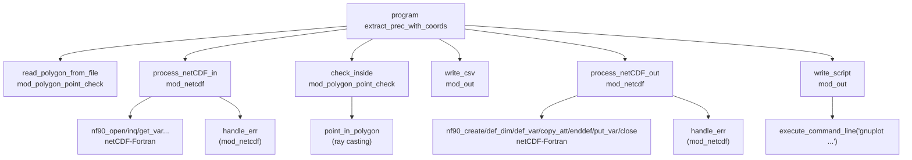

## extract_prec — Extração de precipitação por polígono (NetCDF)

**Resumo**: Este utilitário lê arquivos NetCDF concatenados do BRAMS (ou compatíveis), extrai a variável de precipitação dentro de uma área de contribuição definida por um polígono, e produz:
- **CSV** com série temporal de precipitação total na área e acumulado;
- **PNG** com gráfico gerado automaticamente via gnuplot;
- **NetCDF** de saída contendo a variável original ou mascarada conforme o polígono.

### Componentes principais
- `extract_prec.f90`: programa principal; coordena leitura de argumentos, leitura do polígono, extração/mascara, escrita de CSV/PNG/NetCDF.
- `mod_netcdf.f90` (`mod_netcdf`): rotinas de I/O NetCDF; lê `lat`, `lon` e a variável-alvo; escreve arquivo NetCDF de saída (opcionalmente mascarado).
- `mod_polygon_point_chek.f90` (`mod_polygon_point_check`): verifica se pontos gradeados estão dentro do polígono (algoritmo ray casting); lê polígono de arquivo texto.
- `mod_out.f90` (`mod_out`): gera CSV com totais e acumulados e escreve script gnuplot, chamando o gnuplot para gerar a imagem.
- `le_extrai_netcdf.f90` e `utils.f90`: atualmente vazios (reservados para futuras extensões).

### Requisitos
- Compilador Fortran (ex.: `gfortran`).
- Bibliotecas NetCDF Fortran e C instaladas e disponíveis em tempo de compilação e execução.
- `gnuplot` para gerar o gráfico PNG.
- Ferramentas opcionais como `cdo` para concatenar os NetCDFs de entrada.

### Compilação
Exemplo com `gfortran` (ajuste os caminhos `-I` e `-L` para sua instalação):

```bash
gfortran -O3 -o extract_prec \
  mod_out.f90 mod_netcdf.f90 mod_polygon_point_chek.f90 extract_prec.f90 \
  -I/home/lufla/apps/include -L/home/lufla/apps/lib -lnetcdff -lnetcdf \
  -ffree-form -ffree-line-length-none
```

Se necessário em runtime, ajuste `LD_LIBRARY_PATH` para onde estão as bibliotecas NetCDF.

### Formato do arquivo de entrada NetCDF
O programa espera variáveis de coordenadas nomeadas como `lat`/`latitude` e `lon`/`longitude`, e a variável-alvo (por exemplo, `totprec`) com 3 dimensões: `(x, y, t)`.

Para concatenar múltiplas saídas em um único arquivo com tempo contínuo:

```bash
cdo mergetime $(ls -v <DIR/FRN*.nc>) FRN2025061500-FRN2025063000.nc
```

### Arquivo de polígono (contorno)
Arquivo texto `.txt` contendo pares `lon lat` (separados por espaço), um por linha. O último ponto deve repetir o primeiro para fechar o polígono. Exemplo:

```text
-53.5079174 -33.3531357
-53.5217374 -33.2651499
...
-53.5079174 -33.3531357
```

O nome do arquivo passado na linha de comando deve ser sem a extensão `.txt`; o programa a adiciona automaticamente.

### Uso

```bash
./extract_prec <data_inicial> <data_final> <variavel> <arquivo_contorno_sem_ext> <cria_mapa> <plota_tudo>
```

- **data_inicial**: carimbo no formato `YYYYMMDDHH` (ex.: `2025061500`)
- **data_final**: carimbo no mesmo formato (ex.: `2025063000`)
- **variavel**: nome da variável no NetCDF (ex.: `totprec`)
- **arquivo_contorno_sem_ext**: base do nome do arquivo `.txt` do polígono (ex.: `corumba` → `corumba.txt`)
- **cria_mapa**: `"1"` para gravar NetCDF com máscara do polígono; `"0"` para gravar a variável integral (sem máscara)
- **plota_tudo**: reservado; o gráfico é gerado automaticamente via gnuplot se disponível

Exemplo:

```bash
./extract_prec 2025061500 2025063000 totprec corumba 0 0
```

Arquivos de trabalho esperados/gerados:
- Entrada: `FRN<data_inicial>-FRN<data_final>.nc` (ex.: `FRN2025061500-FRN2025063000.nc`)
- Saída NetCDF: `<variavel>-FRN<data_inicial>-FRN<data_final>.nc`
- Saída CSV: `<contorno>-<data_inicial>-<data_final>.csv`
- Saída PNG: `<contorno>-<data_inicial>-<data_final>.png`
- Script gnuplot auxiliar: `<CSV>.gnu`

### Saídas em detalhe
- **CSV**: três colunas — `Time` (índice de 1 a N horas), `Tot_area` (mm/h na área), `Tot_Accum_Area` (acumulado em mm).
- **PNG**: gráfico com barras (mm/h) e linha (acumulado), eixos y/y2, grade e título contendo o período e o nome do contorno.
- **NetCDF**: copia dimensões, coordenadas e atributos da variável de entrada. Escreve:
  - a variável-alvo integral (`cria_mapa="0"`) ou
  - a variável-alvo mascarada pelo polígono (`cria_mapa="1"`).

### Como funciona internamente (alto nível)
1. Constrói o nome do arquivo de entrada a partir de `data_inicial` e `data_final`.
2. Lê `lat`, `lon` e a variável-alvo do NetCDF.
3. Lê o polígono do arquivo `.txt` e calcula uma máscara ponto-a-ponto (ray casting).
4. Percorre a grade e acumula a precipitação somente nos pontos dentro do polígono; grava CSV.
5. Grava NetCDF de saída com a variável original ou mascarada.
6. Gera script gnuplot e executa para produzir o PNG.

### Dicas e solução de problemas
- Erros do NetCDF são mostrados com a mensagem detalhada de `nf90_strerror`.
- Se o gnuplot não estiver instalado ou falhar, o script `.gnu` será criado; execute manualmente após instalar/corrigir: `gnuplot "<csv>.gnu"`.
- Verifique nomes de variáveis `lat`/`lon`/`variavel` no seu NetCDF; use os alternativos `latitude`/`longitude` se necessário.
- Ajuste caminhos de include/lib (`-I/-L`) e `LD_LIBRARY_PATH` para sua instalação NetCDF.

## Call Tree Diagram

Mermaid diagram of the main program and module calls:



### Textual Outline
- program `extract_prec_with_coords`
  - `read_polygon_from_file` (in `mod_polygon_point_check`)
  - `process_netCDF_in` (in `mod_netcdf`)
    - netCDF calls: `nf90_open`, `nf90_inq_varid`, `nf90_inquire_variable`, `nf90_inquire_dimension`, `nf90_get_var`
    - `handle_err` (on error)
  - `check_inside` (in `mod_polygon_point_check`)
    - `point_in_polygon` (ray casting)
  - `write_csv` (in `mod_out`)
  - `process_netCDF_out` (in `mod_netcdf`)
    - netCDF calls: `nf90_create`, `nf90_def_dim`, `nf90_def_var`, `nf90_copy_att`, `nf90_enddef`, `nf90_put_var`, `nf90_close`
    - `handle_err` (on error)
  - `write_script` (in `mod_out`)
    - `execute_command_line('gnuplot ...')`

## Licença
Este projeto está sob licença CC-GPL 3.0


